# Circlue.ai 데이터베이스 ERD (Entity Relationship Diagram)

## 전체 ERD

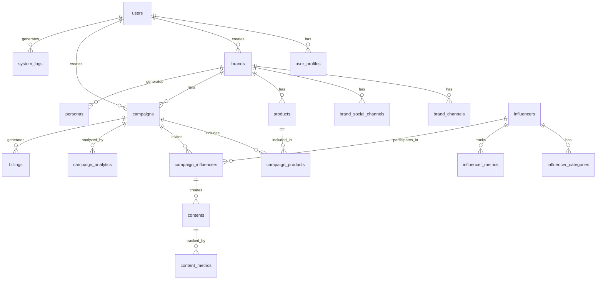
```mermaid
erDiagram
    users ||--o{ user_profiles : has
    users ||--o{ brands : creates
    users ||--o{ campaigns : creates
    users ||--o{ system_logs : generates

    brands ||--o{ brand_channels : has
    brands ||--o{ brand_social_channels : has
    brands ||--o{ products : has
    brands ||--o{ campaigns : runs
    brands ||--o{ personas : generates

    products ||--o{ campaign_products : included_in

    influencers ||--o{ influencer_categories : has
    influencers ||--o{ influencer_metrics : tracks
    influencers ||--o{ campaign_influencers : participates_in

    campaigns ||--o{ campaign_products : includes
    campaigns ||--o{ campaign_influencers : invites
    campaigns ||--o{ campaign_analytics : analyzed_by
    campaigns ||--o{ billings : generates

    campaign_influencers ||--o{ contents : creates
    contents ||--o{ content_metrics : tracked_by
```

## 사용자 관리 테이블 구조

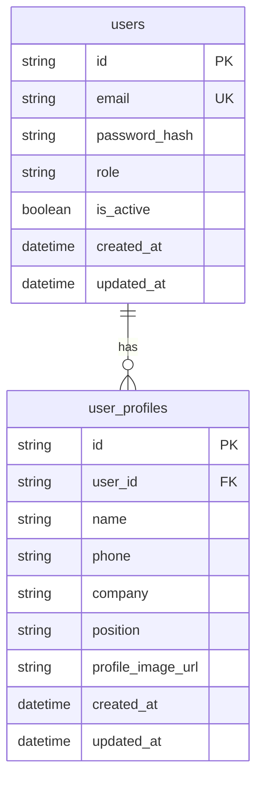
```mermaid
erDiagram
    users {
        string id PK
        string email UK
        string password_hash
        string role
        boolean is_active
        datetime created_at
        datetime updated_at
    }

    user_profiles {
        string id PK
        string user_id FK
        string name
        string phone
        string company
        string position
        string profile_image_url
        datetime created_at
        datetime updated_at
    }

    users ||--o{ user_profiles : has
```

## 브랜드 관리 테이블 구조

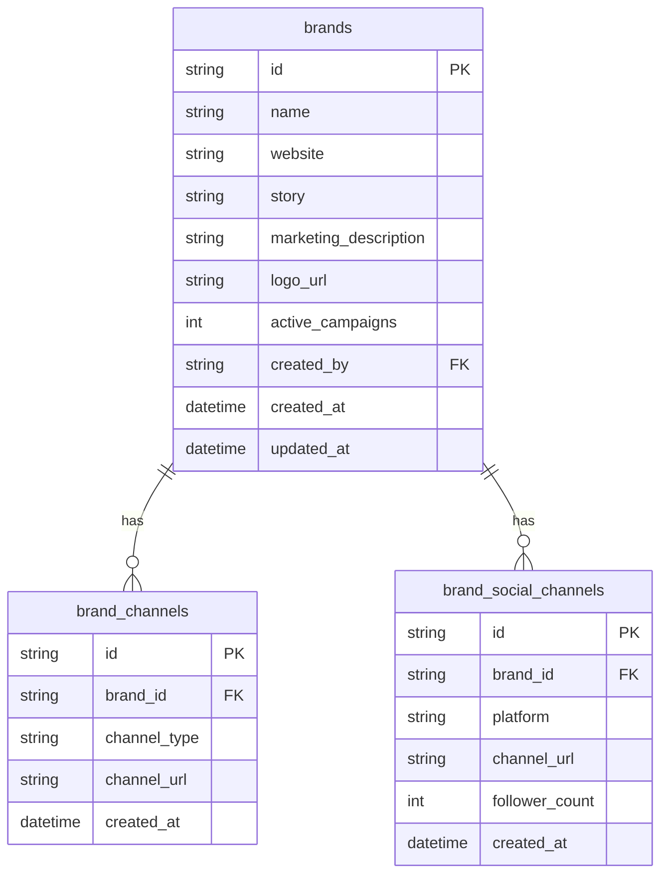
```mermaid
erDiagram
    brands {
        string id PK
        string name
        string website
        string story
        string marketing_description
        string logo_url
        int active_campaigns
        string created_by FK
        datetime created_at
        datetime updated_at
    }

    brand_channels {
        string id PK
        string brand_id FK
        string channel_type
        string channel_url
        datetime created_at
    }

    brand_social_channels {
        string id PK
        string brand_id FK
        string platform
        string channel_url
        int follower_count
        datetime created_at
    }

    brands ||--o{ brand_channels : has
    brands ||--o{ brand_social_channels : has
```

## 제품 관리 테이블 구조

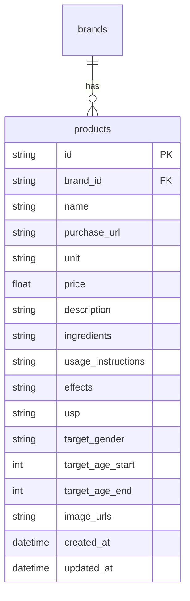
```mermaid
erDiagram
    products {
        string id PK
        string brand_id FK
        string name
        string purchase_url
        string unit
        float price
        string description
        string ingredients
        string usage_instructions
        string effects
        string usp
        string target_gender
        int target_age_start
        int target_age_end
        string image_urls
        datetime created_at
        datetime updated_at
    }

    brands ||--o{ products : has
```

## 인플루언서 관리 테이블 구조

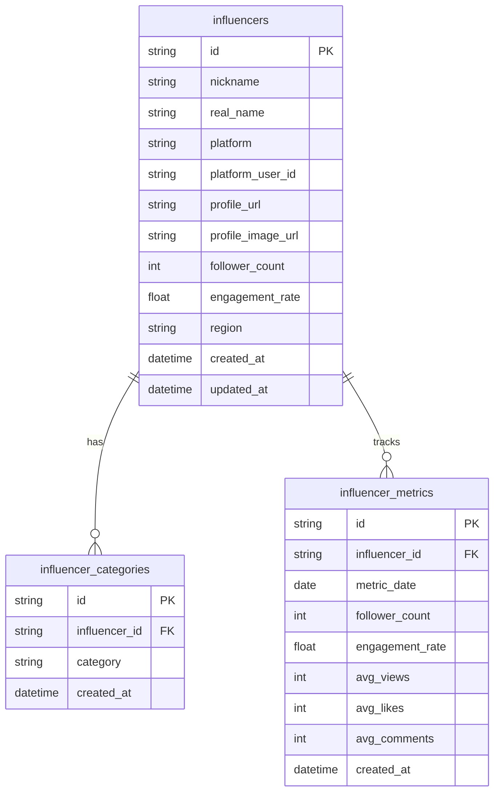
```mermaid
erDiagram
    influencers {
        string id PK
        string nickname
        string real_name
        string platform
        string platform_user_id
        string profile_url
        string profile_image_url
        int follower_count
        float engagement_rate
        string region
        datetime created_at
        datetime updated_at
    }

    influencer_categories {
        string id PK
        string influencer_id FK
        string category
        datetime created_at
    }

    influencer_metrics {
        string id PK
        string influencer_id FK
        date metric_date
        int follower_count
        float engagement_rate
        int avg_views
        int avg_likes
        int avg_comments
        datetime created_at
    }

    influencers ||--o{ influencer_categories : has
    influencers ||--o{ influencer_metrics : tracks
```

## 캠페인 관리 테이블 구조

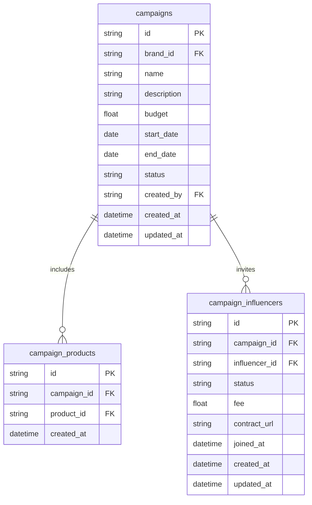
```mermaid
erDiagram
    campaigns {
        string id PK
        string brand_id FK
        string name
        string description
        float budget
        date start_date
        date end_date
        string status
        string created_by FK
        datetime created_at
        datetime updated_at
    }

    campaign_products {
        string id PK
        string campaign_id FK
        string product_id FK
        datetime created_at
    }

    campaign_influencers {
        string id PK
        string campaign_id FK
        string influencer_id FK
        string status
        float fee
        string contract_url
        datetime joined_at
        datetime created_at
        datetime updated_at
    }

    campaigns ||--o{ campaign_products : includes
    campaigns ||--o{ campaign_influencers : invites
```

## 페르소나 및 콘텐츠 관리

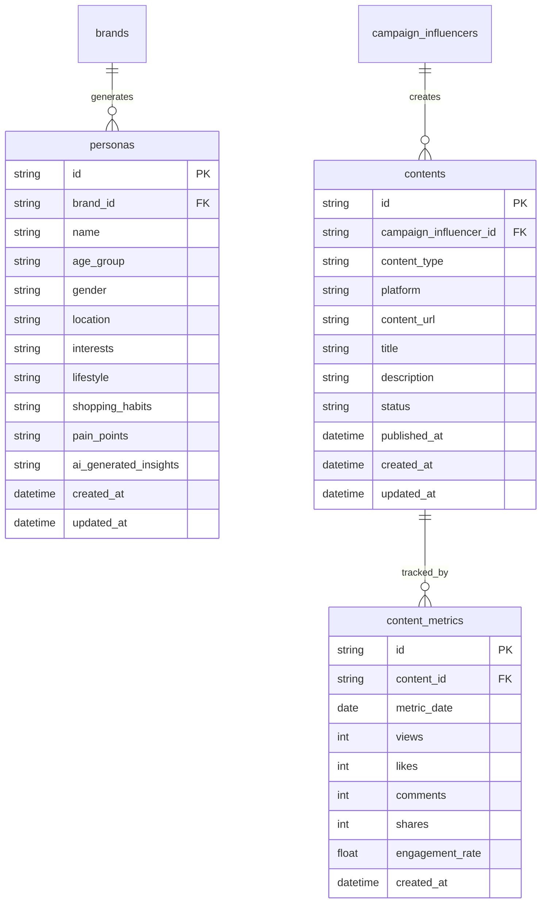
```mermaid
erDiagram
    personas {
        string id PK
        string brand_id FK
        string name
        string age_group
        string gender
        string location
        string interests
        string lifestyle
        string shopping_habits
        string pain_points
        string ai_generated_insights
        datetime created_at
        datetime updated_at
    }

    contents {
        string id PK
        string campaign_influencer_id FK
        string content_type
        string platform
        string content_url
        string title
        string description
        string status
        datetime published_at
        datetime created_at
        datetime updated_at
    }

    content_metrics {
        string id PK
        string content_id FK
        date metric_date
        int views
        int likes
        int comments
        int shares
        float engagement_rate
        datetime created_at
    }

    brands ||--o{ personas : generates
    campaign_influencers ||--o{ contents : creates
    contents ||--o{ content_metrics : tracked_by
```

## 분석 및 정산 관리

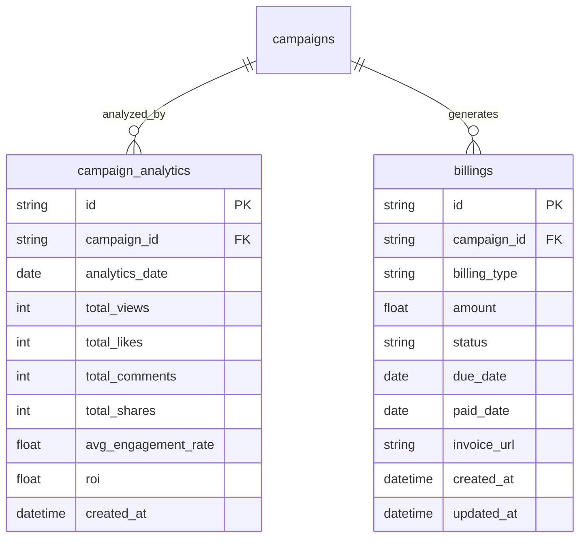
```mermaid
erDiagram
    campaign_analytics {
        string id PK
        string campaign_id FK
        date analytics_date
        int total_views
        int total_likes
        int total_comments
        int total_shares
        float avg_engagement_rate
        float roi
        datetime created_at
    }

    billings {
        string id PK
        string campaign_id FK
        string billing_type
        float amount
        string status
        date due_date
        date paid_date
        string invoice_url
        datetime created_at
        datetime updated_at
    }

    campaigns ||--o{ campaign_analytics : analyzed_by
    campaigns ||--o{ billings : generates
```

## 시스템 관리 테이블

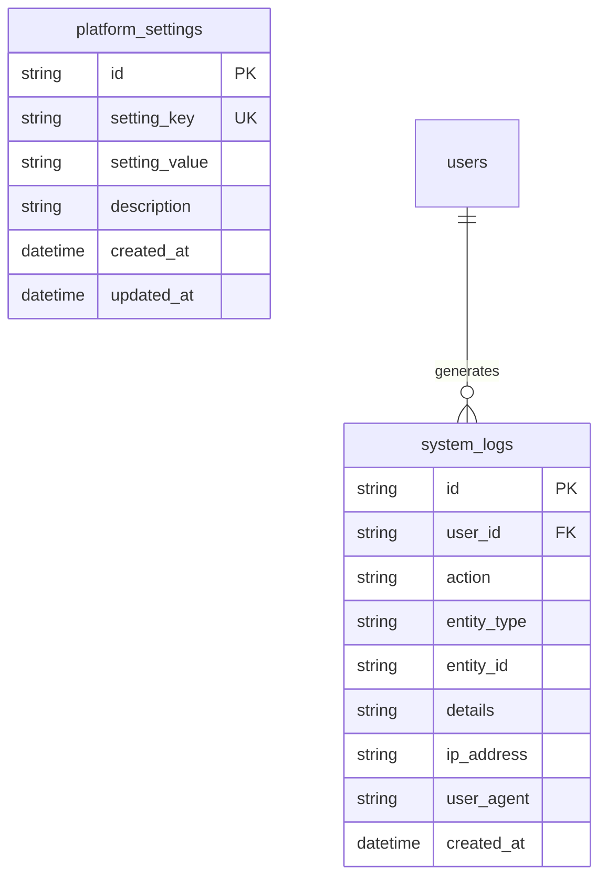
```mermaid
erDiagram
    system_logs {
        string id PK
        string user_id FK
        string action
        string entity_type
        string entity_id
        string details
        string ip_address
        string user_agent
        datetime created_at
    }

    platform_settings {
        string id PK
        string setting_key UK
        string setting_value
        string description
        datetime created_at
        datetime updated_at
    }

    users ||--o{ system_logs : generates
```

## 주요 도메인별 관계도

### 1. 사용자 및 브랜드 관리

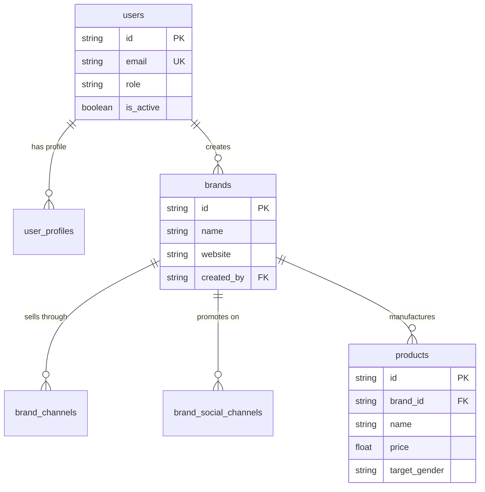
```mermaid
erDiagram
    users ||--o{ user_profiles : "has profile"
    users ||--o{ brands : "creates"
    brands ||--o{ brand_channels : "sells through"
    brands ||--o{ brand_social_channels : "promotes on"
    brands ||--o{ products : "manufactures"

    users {
        string id PK
        string email UK
        string role
        boolean is_active
    }

    brands {
        string id PK
        string name
        string website
        string created_by FK
    }

    products {
        string id PK
        string brand_id FK
        string name
        float price
        string target_gender
    }
```

### 2. 캠페인 워크플로우

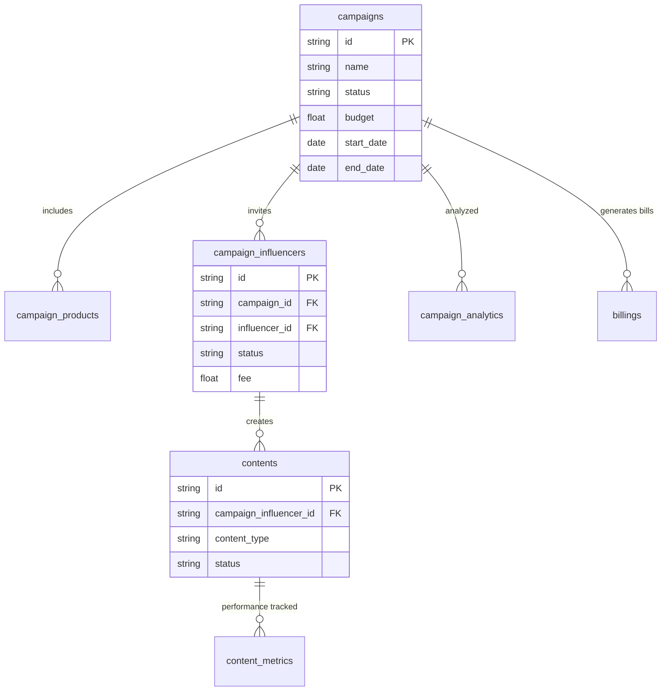
```mermaid
erDiagram
    campaigns ||--o{ campaign_products : includes
    campaigns ||--o{ campaign_influencers : invites
    campaign_influencers ||--o{ contents : creates
    contents ||--o{ content_metrics : "performance tracked"
    campaigns ||--o{ campaign_analytics : analyzed
    campaigns ||--o{ billings : "generates bills"

    campaigns {
        string id PK
        string name
        string status
        float budget
        date start_date
        date end_date
    }

    campaign_influencers {
        string id PK
        string campaign_id FK
        string influencer_id FK
        string status
        float fee
    }

    contents {
        string id PK
        string campaign_influencer_id FK
        string content_type
        string status
    }
```

### 3. 인플루언서 생태계

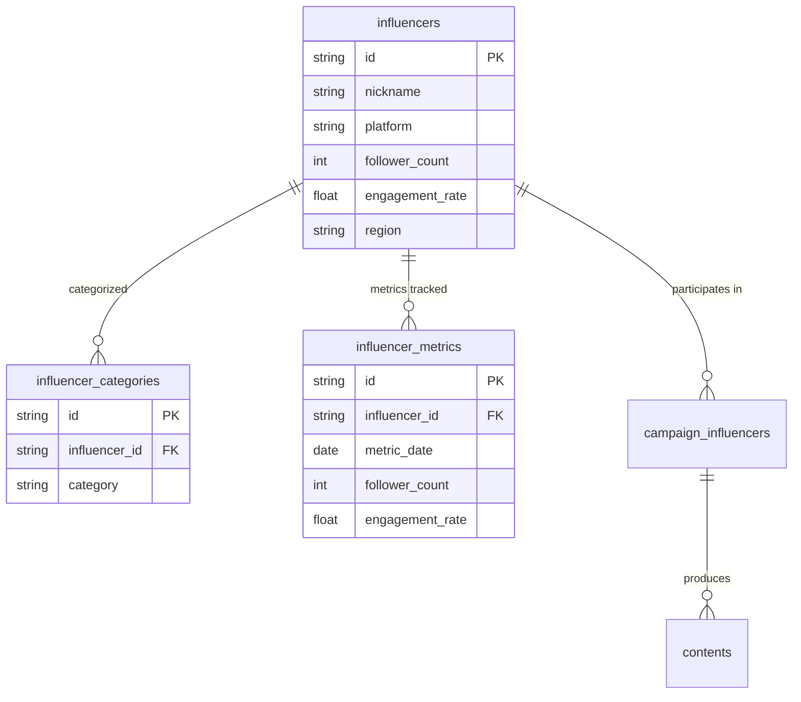
```mermaid
erDiagram
    influencers ||--o{ influencer_categories : categorized
    influencers ||--o{ influencer_metrics : "metrics tracked"
    influencers ||--o{ campaign_influencers : "participates in"
    campaign_influencers ||--o{ contents : produces

    influencers {
        string id PK
        string nickname
        string platform
        int follower_count
        float engagement_rate
        string region
    }

    influencer_categories {
        string id PK
        string influencer_id FK
        string category
    }

    influencer_metrics {
        string id PK
        string influencer_id FK
        date metric_date
        int follower_count
        float engagement_rate
    }
```

### 4. 콘텐츠 및 성과 분석

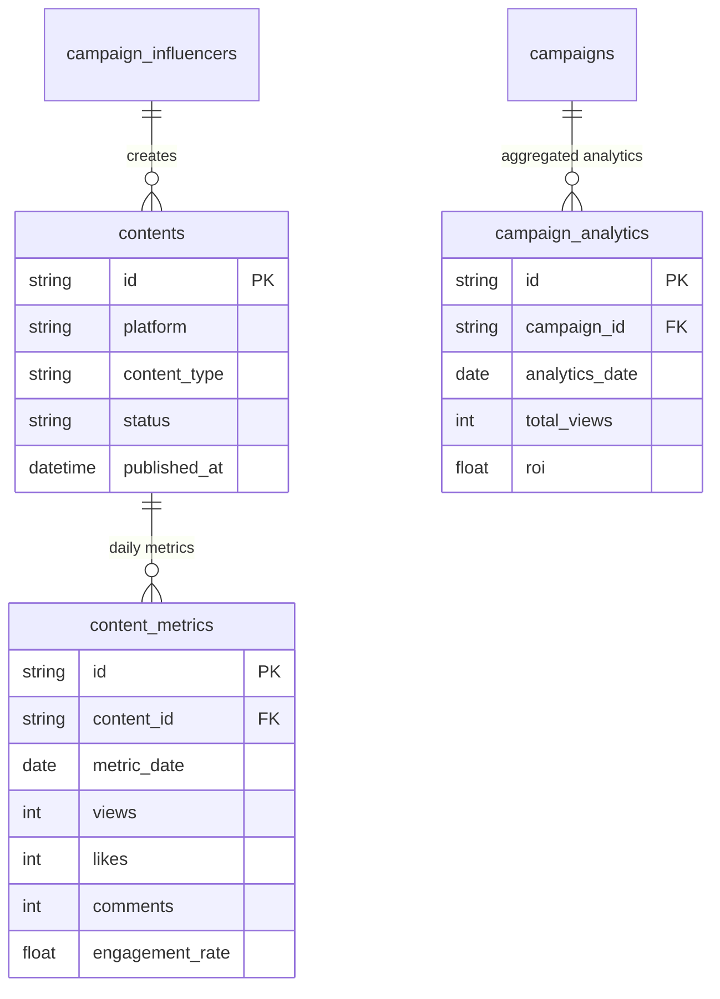
```mermaid
erDiagram
    contents ||--o{ content_metrics : "daily metrics"
    campaigns ||--o{ campaign_analytics : "aggregated analytics"
    campaign_influencers ||--o{ contents : creates

    contents {
        string id PK
        string platform
        string content_type
        string status
        datetime published_at
    }

    content_metrics {
        string id PK
        string content_id FK
        date metric_date
        int views
        int likes
        int comments
        float engagement_rate
    }

    campaign_analytics {
        string id PK
        string campaign_id FK
        date analytics_date
        int total_views
        float roi
    }
```

## 데이터 흐름도

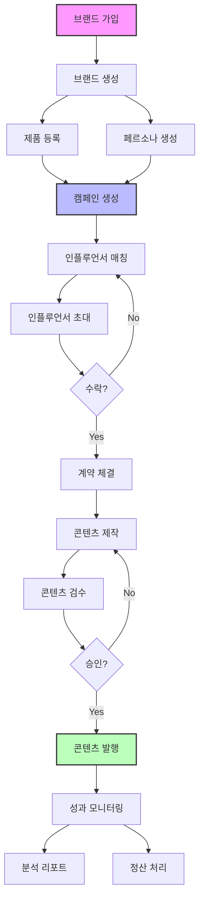
```mermaid
flowchart TD
    A[브랜드 가입] --> B[브랜드 생성]
    B --> C[제품 등록]
    B --> D[페르소나 생성]

    C --> E[캠페인 생성]
    D --> E

    E --> F[인플루언서 매칭]
    F --> G[인플루언서 초대]
    G --> H{수락?}

    H -->|Yes| I[계약 체결]
    H -->|No| F

    I --> J[콘텐츠 제작]
    J --> K[콘텐츠 검수]
    K --> L{승인?}

    L -->|Yes| M[콘텐츠 발행]
    L -->|No| J

    M --> N[성과 모니터링]
    N --> O[분석 리포트]
    N --> P[정산 처리]

    style A fill:#f9f,stroke:#333,stroke-width:2px
    style E fill:#bbf,stroke:#333,stroke-width:2px
    style M fill:#bfb,stroke:#333,stroke-width:2px
```

## 상태 다이어그램

### 캠페인 상태 플로우

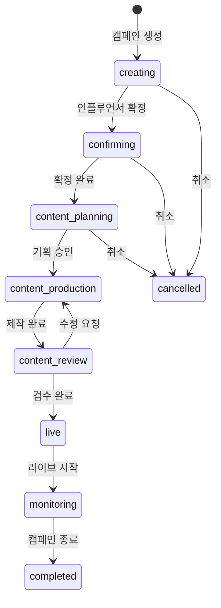
```mermaid
stateDiagram-v2
    [*] --> creating: 캠페인 생성
    creating --> confirming: 인플루언서 확정
    confirming --> content_planning: 확정 완료
    content_planning --> content_production: 기획 승인
    content_production --> content_review: 제작 완료
    content_review --> content_production: 수정 요청
    content_review --> live: 검수 완료
    live --> monitoring: 라이브 시작
    monitoring --> completed: 캠페인 종료

    creating --> cancelled: 취소
    confirming --> cancelled: 취소
    content_planning --> cancelled: 취소
```

### 콘텐츠 상태 플로우

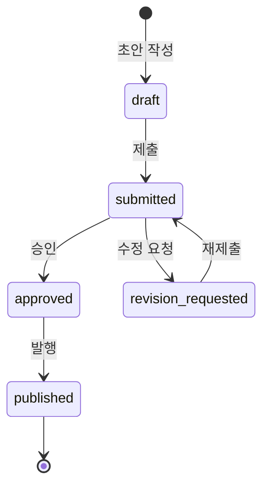
```mermaid
stateDiagram-v2
    [*] --> draft: 초안 작성
    draft --> submitted: 제출
    submitted --> approved: 승인
    submitted --> revision_requested: 수정 요청
    revision_requested --> submitted: 재제출
    approved --> published: 발행
    published --> [*]
```

## 주요 쿼리 패턴

### 1. 브랜드 대시보드 데이터

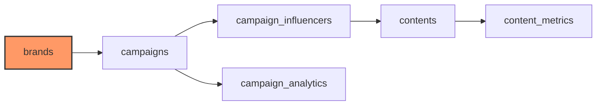
```mermaid
graph LR
    A[brands] --> B[campaigns]
    B --> C[campaign_influencers]
    B --> D[campaign_analytics]
    C --> E[contents]
    E --> F[content_metrics]

    style A fill:#f96,stroke:#333,stroke-width:2px
```

### 2. 인플루언서 검색 및 필터링

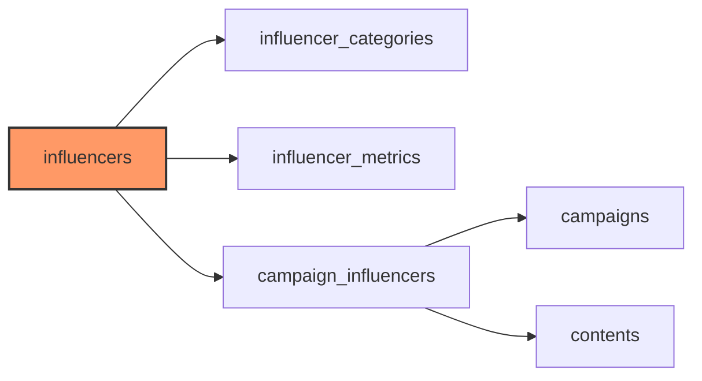
```mermaid
graph LR
    A[influencers] --> B[influencer_categories]
    A --> C[influencer_metrics]
    A --> D[campaign_influencers]
    D --> E[campaigns]
    D --> F[contents]

    style A fill:#f96,stroke:#333,stroke-width:2px
```

## 데이터베이스 인덱싱 전략

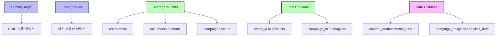
```mermaid
graph TD
    A[Primary Keys] --> B[UUID 자동 인덱스]

    C[Foreign Keys] --> D[참조 무결성 인덱스]

    E[Search Columns] --> F[users.email]
    E --> G[influencers.platform]
    E --> H[campaigns.status]

    I[Join Columns] --> J[brand_id in products]
    I --> K[campaign_id in analytics]

    L[Date Columns] --> M[content_metrics.metric_date]
    L --> N[campaign_analytics.analytics_date]

    style A fill:#bbf,stroke:#333,stroke-width:2px
    style C fill:#bbf,stroke:#333,stroke-width:2px
    style E fill:#bfb,stroke:#333,stroke-width:2px
    style I fill:#bfb,stroke:#333,stroke-width:2px
    style L fill:#fbf,stroke:#333,stroke-width:2px
```
